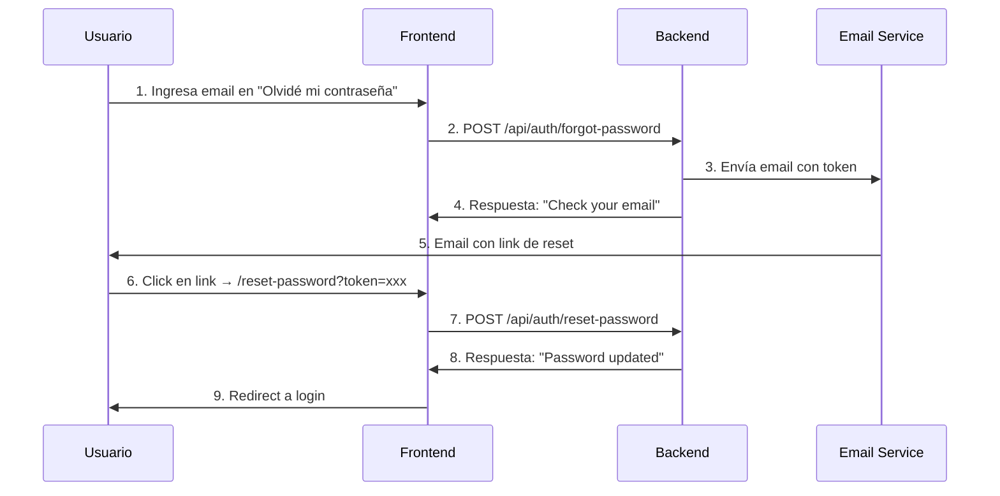

# 🔑 **RECUPERACIÓN DE CONTRASEÑA - GUÍA DE SINCRONIZACIÓN BACKEND-FRONTEND**

## 🎯 **Resumen Ejecutivo**

Este documento detalla los **2 endpoints** de recuperación de contraseña y todos los aspectos técnicos que el frontend necesita para sincronizarse correctamente con el backend.

---

## 🔄 **FLUJO COMPLETO DE RECUPERACIÓN**



---

## 📡 **ENDPOINT 1: SOLICITAR RESET**

### **🔧 Especificación Técnica**

```http
POST /api/auth/forgot-password
Content-Type: application/json
```

### **📤 Request Body**
```typescript
interface ForgotPasswordRequest {
  email: string;  // Email válido del usuario registrado
}
```

### **✅ Ejemplo de Petición**
```javascript
const forgotPassword = async (email) => {
  const response = await fetch(`${API_BASE_URL}/api/auth/forgot-password`, {
    method: 'POST',
    headers: {
      'Content-Type': 'application/json',
      'Accept': 'application/json'
    },
    body: JSON.stringify({ email })
  });
  return await response.json();
};

// Uso:
await forgotPassword("usuario@example.com");
```

### **📨 Respuestas del Backend**

#### **✅ Éxito (200) - SIEMPRE**
```json
{
  "success": true,
  "message": "Si el email existe en nuestro sistema, recibirás un enlace para restablecer tu contraseña",
  "timestamp": "2024-10-17T00:00:00.000Z"
}
```

**🔒 IMPORTANTE**: Por seguridad, el backend **SIEMPRE** retorna éxito, sin revelar si el email existe o no.

#### **❌ Error de Validación (400)**
```json
{
  "success": false,
  "message": "El email es requerido",
  "timestamp": "2024-10-17T00:00:00.000Z"
}
```

```json
{
  "success": false,
  "message": "Por favor ingresa un email válido",
  "timestamp": "2024-10-17T00:00:00.000Z"
}
```

### **📧 Comportamiento del Email**

**Lo que hace el backend:**
1. Genera token JWT válido por **1 hora**
2. Guarda token en la BD del usuario
3. Envía email con link: `${CLIENT_URL}/reset-password?token=XXXXXX`
4. Si falla el email, registra en logs pero NO falla la respuesta

**Link generado:**
```
https://pi-mp-2-front.vercel.app/reset-password?token=eyJhbGciOiJIUzI1NiIsInR5cCI6IkpXVCJ9...
```

---

## 🔑 **ENDPOINT 2: RESTABLECER CONTRASEÑA**

### **🔧 Especificación Técnica**

```http
POST /api/auth/reset-password
Content-Type: application/json
```

### **📤 Request Body**
```typescript
interface ResetPasswordRequest {
  token: string;           // Token del email/URL
  password: string;        // Nueva contraseña
  confirmPassword: string; // Confirmación (OBLIGATORIA)
}
```

### **✅ Ejemplo de Petición**
```javascript
const resetPassword = async (token, newPassword, confirmPassword) => {
  const response = await fetch(`${API_BASE_URL}/api/auth/reset-password`, {
    method: 'POST',
    headers: {
      'Content-Type': 'application/json',
      'Accept': 'application/json'
    },
    body: JSON.stringify({
      token,
      password: newPassword,
      confirmPassword: confirmPassword
    })
  });
  return await response.json();
};

// Uso:
const urlParams = new URLSearchParams(window.location.search);
const token = urlParams.get('token');
await resetPassword(token, "NewPassword123!", "NewPassword123!");
```

### **📨 Respuestas del Backend**

#### **✅ Éxito (200)**
```json
{
  "success": true,
  "message": "Contraseña restablecida exitosamente",
  "data": {
    "redirectTo": "/login"
  },
  "timestamp": "2024-10-17T00:00:00.000Z"
}
```

#### **❌ Errores de Validación (400)**

**Campos faltantes:**
```json
{
  "success": false,
  "message": "Token, contraseña y confirmación de contraseña son requeridos",
  "timestamp": "2024-10-17T00:00:00.000Z"
}
```

**Contraseña débil:**
```json
{
  "success": false,
  "message": "La contraseña debe tener al menos 8 caracteres, una mayúscula, un número y un símbolo",
  "timestamp": "2024-10-17T00:00:00.000Z"
}
```

**Contraseñas no coinciden:**
```json
{
  "success": false,
  "message": "Las contraseñas no coinciden",
  "timestamp": "2024-10-17T00:00:00.000Z"
}
```

**Token inválido/expirado:**
```json
{
  "success": false,
  "message": "Enlace inválido o caducado",
  "timestamp": "2024-10-17T00:00:00.000Z"
}
```

---

## 🏗️ **IMPLEMENTACIÓN FRONTEND REACT + VITE**

### **1. 📝 Página "Olvidé mi Contraseña"**

```jsx
// components/ForgotPassword.jsx
import { useState } from 'react';

const ForgotPassword = () => {
  const [email, setEmail] = useState('');
  const [loading, setLoading] = useState(false);
  const [message, setMessage] = useState('');

  const handleSubmit = async (e) => {
    e.preventDefault();
    setLoading(true);
    
    try {
      const response = await fetch(`${import.meta.env.VITE_API_URL}/api/auth/forgot-password`, {
        method: 'POST',
        headers: {
          'Content-Type': 'application/json'
        },
        body: JSON.stringify({ email })
      });
      
      const data = await response.json();
      
      if (data.success) {
        setMessage('Si tu email está registrado, recibirás un enlace de recuperación.');
      } else {
        setMessage(data.message || 'Error al procesar solicitud');
      }
    } catch (error) {
      setMessage('Error de conexión. Intenta de nuevo.');
    } finally {
      setLoading(false);
    }
  };

  return (
    <form onSubmit={handleSubmit}>
      <h2>Recuperar Contraseña</h2>
      
      <input
        type="email"
        value={email}
        onChange={(e) => setEmail(e.target.value)}
        placeholder="Ingresa tu email"
        required
      />
      
      <button type="submit" disabled={loading}>
        {loading ? 'Enviando...' : 'Enviar enlace'}
      </button>
      
      {message && <p>{message}</p>}
    </form>
  );
};

export default ForgotPassword;
```

### **2. 🔑 Página "Restablecer Contraseña"**

```jsx
// components/ResetPassword.jsx
import { useState, useEffect } from 'react';
import { useNavigate, useSearchParams } from 'react-router-dom';

const ResetPassword = () => {
  const [searchParams] = useSearchParams();
  const navigate = useNavigate();
  const [formData, setFormData] = useState({
    password: '',
    confirmPassword: ''
  });
  const [loading, setLoading] = useState(false);
  const [error, setError] = useState('');
  const [token, setToken] = useState('');

  useEffect(() => {
    const tokenFromUrl = searchParams.get('token');
    if (!tokenFromUrl) {
      setError('Token de recuperación no válido');
      return;
    }
    setToken(tokenFromUrl);
  }, [searchParams]);

  const validatePassword = (password) => {
    const regex = /^(?=.*[a-z])(?=.*[A-Z])(?=.*\d)(?=.*[@$!%*?&])[A-Za-z\d@$!%*?&]{8,}$/;
    return regex.test(password);
  };

  const handleSubmit = async (e) => {
    e.preventDefault();
    setError('');
    
    // Validaciones client-side
    if (!validatePassword(formData.password)) {
      setError('La contraseña debe tener al menos 8 caracteres, una mayúscula, un número y un símbolo');
      return;
    }
    
    if (formData.password !== formData.confirmPassword) {
      setError('Las contraseñas no coinciden');
      return;
    }
    
    setLoading(true);
    
    try {
      const response = await fetch(`${import.meta.env.VITE_API_URL}/api/auth/reset-password`, {
        method: 'POST',
        headers: {
          'Content-Type': 'application/json'
        },
        body: JSON.stringify({
          token,
          password: formData.password,
          confirmPassword: formData.confirmPassword
        })
      });
      
      const data = await response.json();
      
      if (data.success) {
        alert('Contraseña actualizada exitosamente');
        navigate('/login');
      } else {
        setError(data.message || 'Error al restablecer contraseña');
      }
    } catch (error) {
      setError('Error de conexión. Intenta de nuevo.');
    } finally {
      setLoading(false);
    }
  };

  if (!token) {
    return <div>Token inválido</div>;
  }

  return (
    <form onSubmit={handleSubmit}>
      <h2>Nueva Contraseña</h2>
      
      <input
        type="password"
        value={formData.password}
        onChange={(e) => setFormData({...formData, password: e.target.value})}
        placeholder="Nueva contraseña"
        required
      />
      
      <input
        type="password"
        value={formData.confirmPassword}
        onChange={(e) => setFormData({...formData, confirmPassword: e.target.value})}
        placeholder="Confirmar contraseña"
        required
      />
      
      {error && <p style={{color: 'red'}}>{error}</p>}
      
      <button type="submit" disabled={loading}>
        {loading ? 'Actualizando...' : 'Actualizar contraseña'}
      </button>
    </form>
  );
};

export default ResetPassword;
```

### **3. 🛣️ Configuración de Rutas**

```jsx
// App.jsx o router.jsx
import { BrowserRouter, Routes, Route } from 'react-router-dom';
import ForgotPassword from './components/ForgotPassword';
import ResetPassword from './components/ResetPassword';

function App() {
  return (
    <BrowserRouter>
      <Routes>
        {/* Otras rutas */}
        <Route path="/forgot-password" element={<ForgotPassword />} />
        <Route path="/reset-password" element={<ResetPassword />} />
      </Routes>
    </BrowserRouter>
  );
}
```

---

## 🔒 **ASPECTOS DE SEGURIDAD**

### **🛡️ Validaciones del Backend**

1. **Email**: Formato válido, usuario debe existir y estar activo
2. **Token**: JWT válido, no expirado (1 hora), coincide con BD
3. **Password**: Mínimo 8 caracteres, mayúscula, minúscula, número, símbolo
4. **confirmPassword**: Debe coincidir exactamente con password

### **⏰ Tiempos de Expiración**

- **Token de reset**: **1 hora** desde generación
- **Limpieza automática**: Tokens expirados se limpian al intentar usar

### **🚨 Comportamientos de Seguridad**

- **No revelación**: Nunca dice si el email existe o no
- **Un solo uso**: Token se borra después de usar exitosamente
- **Validación doble**: Token debe estar en JWT Y en BD del usuario

---

## 🧪 **TESTING Y DEBUGGING**

### **📋 Casos de Prueba**

#### **Test 1: Flujo completo exitoso**
```javascript
// 1. Solicitar reset
const response1 = await forgotPassword("test@example.com");
// Verificar: response1.success === true

// 2. Obtener token del email/logs
const token = "obtenido_del_email";

// 3. Restablecer contraseña
const response2 = await resetPassword(token, "NewPass123!", "NewPass123!");
// Verificar: response2.success === true
```

#### **Test 2: Token expirado**
```javascript
// Usar token de más de 1 hora
const response = await resetPassword("token_expirado", "NewPass123!", "NewPass123!");
// Verificar: response.message === "Enlace inválido o caducado"
```

#### **Test 3: Contraseñas no coinciden**
```javascript
const response = await resetPassword("token_valido", "Pass123!", "Different456!");
// Verificar: response.message === "Las contraseñas no coinciden"
```

### **🔍 Debugging en DevTools**

**1. Verificar Request (forgot-password):**
```json
// Network → Payload
{
  "email": "test@example.com"
}
```

**2. Verificar Request (reset-password):**
```json
// Network → Payload
{
  "token": "eyJhbGciOiJIUzI1NiIsInR5cCI6IkpXVCJ9...",
  "password": "NewPassword123!",
  "confirmPassword": "NewPassword123!"
}
```

**3. Headers esperados:**
```
Content-Type: application/json
Accept: application/json
```

---

## ⚙️ **CONFIGURACIÓN DE VARIABLES DE ENTORNO**

### **🖥️ Backend (Render)**
```bash
CLIENT_URL=https://pi-mp-2-front.vercel.app  # Sin /login al final
JWT_SECRET=tu_jwt_secret_seguro
EMAIL_SERVICE=SendGrid
SENDGRID_API_KEY=tu_api_key
```

### **⚛️ Frontend (Vite)**
```bash
# .env
VITE_API_URL=https://pi-mp-2-back-prod.onrender.com

# .env.local (desarrollo)
VITE_API_URL=http://localhost:5000
```

---

## 🚨 **ERRORES COMUNES Y SOLUCIONES**

### **❌ Error 1: "Token inválido o caducado"**
**Causas:**
- Token expiró (>1 hora)
- Token malformado en URL
- Token ya fue usado
- Usuario no existe

**Solución Frontend:**
```javascript
if (data.message === "Enlace inválido o caducado") {
  // Mostrar mensaje: "Este enlace ha expirado. Solicita uno nuevo"
  // Redirect a /forgot-password
}
```

### **❌ Error 2: CORS en desarrollo**
**Causa:** Frontend en localhost:5173 no permitido

**Solución:** Verificar que el backend tenga:
```javascript
// Ya configurado en tu backend
allowedOrigins = ['http://localhost:5173', 'https://pi-mp-2-front.vercel.app']
```

### **❌ Error 3: Email no llega**
**Debugging:**
1. Verificar logs del backend
2. Confirmar configuración SendGrid
3. Verificar carpeta spam
4. El backend simula envío si falla (check logs)

---

## 📋 **CHECKLIST DE IMPLEMENTACIÓN**

### **Backend (Ya implementado) ✅**
- [ ] ✅ Endpoint `/api/auth/forgot-password`
- [ ] ✅ Endpoint `/api/auth/reset-password`
- [ ] ✅ Validación de email y contraseña
- [ ] ✅ Generación y verificación de tokens JWT
- [ ] ✅ Integración con servicio de email
- [ ] ✅ Configuración de CORS para React + Vite

### **Frontend (Por implementar)**
- [ ] Página de "Olvidé mi contraseña" (/forgot-password)
- [ ] Página de "Restablecer contraseña" (/reset-password)
- [ ] Validación client-side de contraseña
- [ ] Manejo de errores y estados de loading
- [ ] Extracción de token desde URL params
- [ ] Redirects apropiados después de éxito/error
- [ ] Variables de entorno configuradas (VITE_API_URL)

### **Testing**
- [ ] Probar flujo completo en desarrollo
- [ ] Verificar recepción de emails
- [ ] Validar expiración de tokens
- [ ] Confirmar redirects y UX

---

## 📞 **CONTACTO TÉCNICO**

**Para problemas de sincronización:**

1. **Backend logs**: Revisar consola de Render para errores
2. **Email delivery**: Verificar configuración SendGrid
3. **CORS**: Confirmar orígenes permitidos  
4. **Tokens**: Validar que no estén malformados en URL

**Repositorio Backend**: https://github.com/Unyfilm/PI-MP--2-BACK  
**Endpoints de producción**:
- `POST https://pi-mp-2-back-prod.onrender.com/api/auth/forgot-password`
- `POST https://pi-mp-2-back-prod.onrender.com/api/auth/reset-password`

---

**Documento creado**: Octubre 17, 2025  
**Versión del Backend**: v2.1.0 (Password Reset + CORS Multi-Origin)